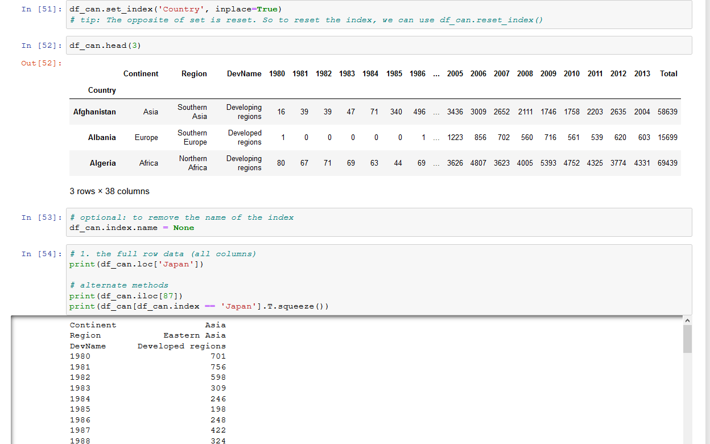
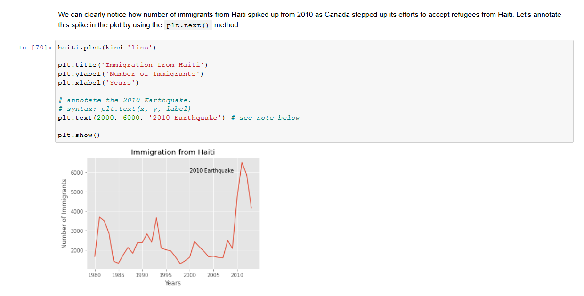
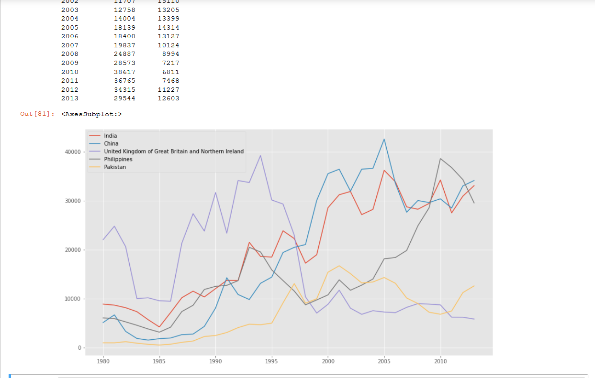

title: Data Visualization with Python
date: "2021-05-23"
description: " Data visualization is the graphical of data in order to interactively and efficiently convey insights to clients,customers,and stakeholders in general,It is a way to summarize your findings and display it in a form that facilities interpretation and can help in identifying patterns or trends."


  

we will learn about:

<font color=red>Data visualization and some of the best practices when creating plots and visuals.</font>

<font color=red>The history and architecture of Matplotlib ,and how to do basic plotting with Matplotlib.</font>

<font color=red>Generating different visualization tools using Matplotlib such as line plots,are plots,histograms,bar charts,box plots, and pie charts.</font>

<font color=red> Seaborn, another data visualization library in Python, and how to use it to create attractive statistical graphics. </font>

<font color=red>Folium, and how to use to create maps and visualize geospatial data. </font>


### Syllabus

**Module 1 - Introduction to Visualization Tools**

- - Introduction to Data Visualization
  - Introduction to Matplotlib
  - Basic Plotting with Matplotlib
  - Dataset on Immigration to Canada
  - Line Plots

**Module 2 - Basic Visualization Tools**

- - Area Plots
  - Histograms
  - Bar Charts

***Module 3 - Specialized Visualization Tools***

- - Pie Charts
  - Box Plots
  - Scatter Plots
  - Bubble Plots

**Module 4 - Extra Visualization Tools**

- - Waffle Charts
  - Word Clouds
  - Seaborn and Regression Plots

**Module 5 - Creating Maps and Visualizing Geospatial Data**

- - Introduction to Folium and Map Styles
  - Maps with Markers 
  - Choropleth Maps


**Why Build Visual?**

1. For exploratory data analysis

2. Communicate data clearly

3. Share unbiased representation of data

4. Use them to support recommendations to different stakeholders.

   

**Best Practices**

When creating a visual,always remember:

1. Less is more effective
2. Less is more attractive
3. Less is more impactive

   

**Introduction to Matplotlib**

Matplotlib-History:

1. Joh Hunter(1968-2012) 

   

2. EEG/ECog Visualization Tool 

   

3. Analogous to Matlab scripting interface


**Matplotlib Architecture**


**Backend Layer**

Has three built-in abstract interface classes:

1. FigureCanvas:**matplotlib.backend_bases.FigureCanvas**

-  Encompasses the area onto which the figure is drawn             

​    2.Renderer: **matplotlib.backend_bases.Renderer**

- Knows how to draw on the FigureCanvas

3. Event:**matplotlib.backend_bases.Event**
   - Handles user inputs such as keyboard strokes and mouse clicks


**Artist Layer**

- Comprised of one main object --Artist:

  - knows how to use the Renderer to draw on the canvas.    

- Title,lines,tick labels,and images,all correspond to individual Artist instances.

- Two types of **Artist** objects:

  1.    **primitive:** Line2D, Rectangle,Circle, and Text

  2. **Composite:** Axis,Tick,Axes,and Figure

     

- Each composite artist may contain other composite artists as well as primitive artists.


**Putting the Artist Layer to Use**

Let's try to generate a histogram of some data using the Artist layer:


# Scripting Layer

- Comprised mainly of **pyplot** , a scripting interface that is lighter that the **Artist** layer.

- Let's see how we can generate the same histogram of 10000 random values using the **pyplot** interface.

  


**Matplotlib -Jupyter Notebook**

**Matplotlib - Plot Function**


**Matplotlib Backends-Inline**


**Matplotlib Backends - Notebook**


**Matplotlib - Pandas**


## Immigration Data to Canada


### Dataset

- **The Population Division of the United Nations complied data pertaining to 45 countries.**

- **For each country,annual data on the flows of international migrants is reported in addition to other metadata.**

- **We will primarily work with a United Nations data on immigration to Canada**

  


### Line Plots

**A line plot is a type of plot which displays information as a series of data points called 'markers' connected by straight line segments.**


### Creating Line Plots


## Exploring Datasets with pandas

pandas is an essential data analysis toolkit for python.

**pandas is a Python package providing fast,flexible and expressive data structures designed to make working with "relational" or "labeled" data both easy and intuitive. It aims to be the fundamental high-level building block for doing practical,real world data analysis in Python.**

The course heavily relies on *pandas* for data wrangling, analysis, and visualization. We encourage you to spend some time and familizare yourself with the *pandas* API Reference: http://pandas.pydata.org/pandas-docs/stable/api.html.

## The Dataset: Immigration to Canada from 1980 to 2013 

Dataset Source: [International migration flows to and from selected countries - The 2015 revision](http://www.un.org/en/development/desa/population/migration/data/empirical2/migrationflows.shtml).

The dataset contains annual data on the flows of international immigrants as recorded by the countries of destination. The data presents both inflows and outflows according to the place of birth, citizenship or place of previous / next residence both for foreigners and nationals. The current version presents data pertaining to 45 countries.


### pandas Basics

The first thing we will do is import two key data analysis modules: pandas and **Numpy**.

import numpy as np
import pandas as pd

df_can = pd.read_excel('https://cf-courses-data.s3.us.cloud-object-storage.appdomain.cloud/IBMDeveloperSkillsNetwork-DV0101EN-SkillsNetwork/Data%20Files/Canada.xlsx',
                        sheet_name='Canada by Citizenship',
                       skiprows=range(20),
                       skipfooter=2)

print ('Data read into a pandas dataframe!')


Let's view the top 5 rows of the dataset using the head() function.

**df_can.head()**


We can also view the bottom 5 rows of the dataset using the **tail()** function.


When analyzing a dataset,it's  always a good idea to start by getting basic information about your dataframe. We can do this by using the **info() **method.

This method can be used to get a short summary of the dataframe.

to get the list of column headers we can all upon the dataframe's **.columns** parameter.

Similarly,to get the list of indicies we use the **.index** parameter


Note: The default type of index and columns is NOT list

To get the index and columns as lists,we can use the tolist() method.

To view the dimensions of the dataframe, we use the **.shape** parameter.


Note: The main types stored in *pandas* objects are *float*, *int*, *bool*, *datetime64[ns]* and *datetime64[ns, tz] (in >= 0.17.0)*, *timedelta[ns]*, *category (in >= 0.15.0)*, and *object* (string). In addition these dtypes have item sizes, e.g. int64 and int32.

Let's clean the data set to remove a few unnecessary columns. We can use *pandas* **`drop()`** method as follows:

Let's rename the columns so that they make sense. we can use **rename()** method by passing in a dictionary of old and new names as follows:

we will also add a 'Total' column that sums up the total immigrants by country over the entire period period 1980-2013,as follows:

We can check to see how many null objects we have in the dataset as follows:


Finally, let's view a quick summary of each column in our dataframe using the **`describe()`** method.


------

## *pandas* Intermediate: Indexing and Selection (slicing)


### Select Column

**There are two ways to filter on a column name:**

Method 1: Quick and easy, but only works if the column name does NOT have spaces or special characters.

```python
    df.column_name 
        (returns series)
```

Method 2: More robust, and can filter on multiple columns.

```python
    df['column']  
        (returns series)
    df[['column 1', 'column 2']] 
        (returns dataframe)
```


Example: Let's try filtering on the list of countries ('Country').

df_can.Country  # returns a series


Let's try filtering on the list of countries ('OdName') and the data for years: 1980 - 1985.


### Select Row

There are main 3 ways to select rows:

```python
    df.loc[label]        
        #filters by the labels of the index/column
    df.iloc[index]       
        #filters by the positions of the index/column
```

Before we proceed, notice that the defaul index of the dataset is a numeric range from 0 to 194. This makes it very difficult to do a query by a specific country. For example to search for data on Japan, we need to know the corressponding index value.

This can be fixed very easily by setting the 'Country' column as the index using **`set_index()`** method.




Column names that are integers (such as the years) might introduce some confusion. For example, when we are referencing the year 2013, one might confuse that when the 2013th positional index.

To avoid this ambuigity, let's convert the column names into strings: '1980' to '2013'.

Since we converted the years to string, let's declare a variable that will allow us to easily call upon the full range of years:


### Filtering based on a criteria

To filter the dataframe based on a condition, we simply pass the condition as a boolean vector.

For example, Let's filter the dataframe to show the data on Asian countries (AreaName = Asia).


# Visualizing Data using Matplotlib

## Matplotlib: Standard Python Visualization Library

The primary plotting library we will explore in the course is [Matplotlib](http://matplotlib.org/). As mentioned on their website:

> Matplotlib is a Python 2D plotting library which produces publication quality figures in a variety of hardcopy formats and interactive environments across platforms. Matplotlib can be used in Python scripts, the Python and IPython shell, the jupyter notebook, web application servers, and four graphical user interface toolkits.

If you are aspiring to create impactful visualization with python, Matplotlib is an essential tool to have at your disposal.

### Matplotlib.Pyplot

One of the core aspects of Matplotlib is `matplotlib.pyplot`. It is Matplotlib's scripting layer which we studied in details in the videos about Matplotlib. Recall that it is a collection of command style functions that make Matplotlib work like MATLAB. Each `pyplot` function makes some change to a figure: e.g., creates a figure, creates a plotting area in a figure, plots some lines in a plotting area, decorates the plot with labels, etc. In this lab, we will work with the scripting layer to learn how to generate line plots. In future labs, we will get to work with the Artist layer as well to experiment first hand how it differs from the scripting layer.

Let's start by importing `Matplotlib` and `Matplotlib.pyplot` as follows:


### Plotting in *pandas*

Fortunately, pandas has a built-in implementation of Matplotlib that we can use. Plotting in *pandas* is as simple as appending a `.plot()` method to a series or dataframe.

Documentation:

- [Plotting with Series](http://pandas.pydata.org/pandas-docs/stable/api.html#plotting)
- [Plotting with Dataframes](http://pandas.pydata.org/pandas-docs/stable/api.html#api-dataframe-plotting)


# Line Pots (Series/Dataframe) 

**What is a line plot and why use it?**

A line chart or line plot is a type of plot which displays information as a series of data points called 'markers' connected by straight line segments. It is a basic type of chart common in many fields. Use line plot when you have a continuous data set. These are best suited for trend-based visualizations of data over a period of time.

**Let's start with a case study:**

In 2010, Haiti suffered a catastrophic magnitude 7.0 earthquake. The quake caused widespread devastation and loss of life and aout three million people were affected by this natural disaster. As part of Canada's humanitarian effort, the Government of Canada stepped up its effort in accepting refugees from Haiti. We can quickly visualize this effort using a `Line` plot:

**Question:** Plot a line graph of immigration from Haiti using `df.plot()`.

First, we will extract the data series for Haiti.


With just a few lines of code, you were able to quickly identify and visualize the spike in immigration!

Quick note on x and y values in `plt.text(x, y, label)`:
    
     Since the x-axis (years) is type 'integer', we specified x as a year. The y axis (number of immigrants) is type 'integer', so we can just specify the value y = 6000.

```python
    plt.text(2000, 6000, '2010 Earthquake') # years stored as type int
```
    If the years were stored as type 'string', we would need to specify x as the index position of the year. Eg 20th index is year 2000 since it is the 20th year with a base year of 1980.
```python
    plt.text(20, 6000, '2010 Earthquake') # years stored as type int
```
    We will cover advanced annotation methods in later modules.

```
    We will cover advanced annotation methods in later modules.
```

We can easily add more countries to line plot to make meaningful comparisons immigration from different countries.

**Question:** Let's compare the number of immigrants from India and China from 1980 to 2013.

Step 1: Get the data set for China and India, and display dataframe.






### Other Plots

Congratulations! you have learned how to wrangle data with python and create a line plot with Matplotlib. There are many other plotting styles available other than the default Line plot, all of which can be accessed by passing `kind` keyword to `plot()`. The full list of available plots are as follows:

- `bar` for vertical bar plots
- `barh` for horizontal bar plots
- `hist` for histogram
- `box` for boxplot
- `kde` or `density` for density plots
- `area` for area plots
- `pie` for pie plots
- `scatter` for scatter plots
- `hexbin` for hexbin plot

