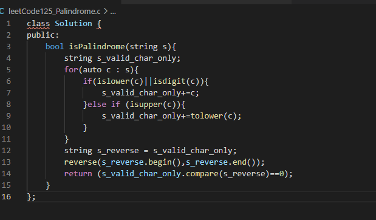
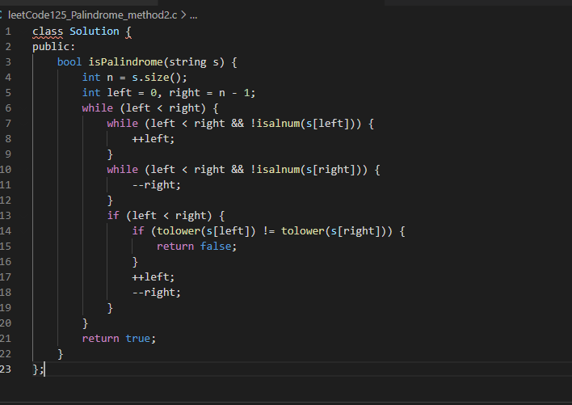

---

title: "LeetCode for Maxwell"
date: "2021-05-30"
description:  "Practice,Practice,practice. Stay hungry,Stay foolish."

---

## LeedCode125.Valid Palindrome

### Diffculty: easy

**Given a string s,determine if it is a palindrome,considering only alphanumeric characters and ignoring cases.**

Example 1:

Input: s = "A man, a plan, a canal: Panama"
Output: true
Explanation: "amanaplanacanalpanama" is a palindrome.
Example 2:

Input: s = "race a car"
Output: false
Explanation: "raceacar" is not a palindrome.

Constraints:

1 <= s.length <= 2 * 105
s consists only of printable ASCII characters.

### Solution1

**Step 1: The basic design idea of the algorithm**

1. Remove characters other than letters and numbers in the input strings,and modify the case of all letters to be consistent.
2. Reverse the modified string s and determine whether it is equal to itself.

**Step 2:Algorithm Description**

**Step3: Algorithm time and space complexity**

the length of the input string s is **n**

time complexity : **O(n)**

space complexity :  **O(n)**

### Solution2

**Step 1: The basic design idea of the algorithm**

method: **Double pointer method**

1. Initialize two pointers left and right,which point to the first and last characters of s respectively.
2. Each time it compares whether the characters pointed to by left  and right are equal,
3. if they are equal each other,move the left pointer to the last number or letter,and move right pointer to the previous number or letter.
4. if they are not equal each other,means it's not palindrome.
5. always compare,until the left is larger or equal to right,it's mean check out the string S is palindrome.

**Step 2:Algorithm Description**

**Step3: Algorithm time and space complexity**

the length of the input string s is **n**

time complexity : **O(n)**

space complexity :  **O(1)**

