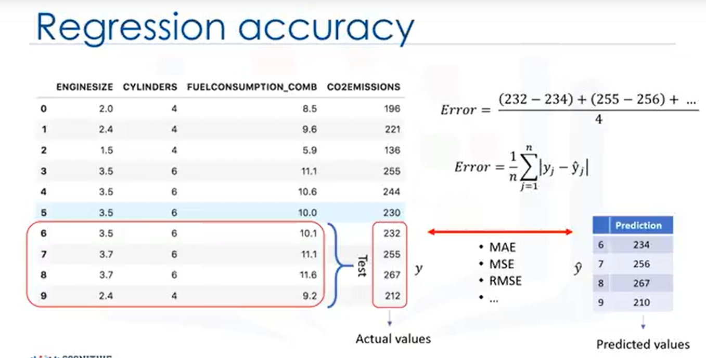

### A FEW THINGS TO KNOW ABOUT THIS COURSE
* This course is self-paced. There is no instructor to follow or to rush you along - you learn on your own schedule. This also means you are going to need to be disciplined in your studies.
* You can start it at any time and you can take as long as you need to complete it. Your place in the course will be remembered and your labs will be saved. However, we strongly recommend that you don't take prolonged breaks between lessons as the mind tends to forget what it does not practice.
* You can take the course (audit) as many times as you wish.
* There is only ONE chance to pass the course, but you can make multiple attempts per question (see the Grading Scheme section for details)
* This is a hands-on course where you will gain practical skill by doing hands-on labs. We provide a a complete virtual lab environment on the cloud that you can access from anywhere as long as you have internet connection.
* We strongly recommend that you use Chrome or Firefox browser
* You can learn on mobile device if you install Cognitive Class mobile app from Apple App Store (coming soon) or Google Play Store.

### Learning Objectives
#### In this course you will learn about:
- How Statistical Modeling relates to Machine Learning and do a comparison of each.
- Real-life examples of Machine learning and how it affects society in ways you may not have guessed!
- In the labs: Use Python libraries for Machine Learning, such as scikit-learn.

#### Explore many algorithms and models:
- Popular algorithms: Regression, Classification, and Clustering
- Recommender Systems: Content-Based and Collaborative Filtering
- Popular models: Train/Test Split, Gradient Descent, and Mean Squared Error
- Get ready to do more learning than your machine!

### Syllabus
#### Module 1 - Machine Learning
- Python for Machine Learning
- Supervised vs Unsupervised

#### Module 2 - Regression
- Simple Linear Regression
- Multiple Linear Regression
- Model Evaluation in Regression Models
- Non-Linear Regression

#### Module 3 - Classification
- K-Nearest Neighbors
- Decision Trees
- Evaluation Metrics in Classification
- Logistic Regression vs Linear Regressin
- Support Vector Machine (SVM)

#### Module 4 - Clustering
- K-Means Clustering
- Hierarchical Clustering
- DBSCAN

#### Module 5 - Recommender Systems
- Content-Based Recommender Systems
- Collaborative Filtering

###  Learning Objectives

- Machine Learning applications
- Python libraries for Machine Learning
- Supervised vs Unsupervised Learning

#### Intro to Machine Learning
Machine learning is the subfield of computer science that gives "computers the ability to learn without being explicitly programmed.” First, how do you think Netflix and Amazon recommend videos, movies, and TV shows to its users? They **use Machine Learning to produce suggestions that you might enjoy!** This is similar to how your friends might recommend a television show to you, based on their knowledge of the types of shows you like to watch. How do you think banks make a decision when approving a loan application? They **use machine learning to predict the probability of default for each applicant, and then approve or refuse the loan application based on that probability.** **Telecommunication companies use their customers’ demographic data to segment them, or predict if they will unsubscribe from their company the next month.** There are many other applications of machine learning that we see every day in our daily life, such as chatbots, logging into our phones or even computer games using face recognition Each of these use different machine learning techniques and algorithms. So, let’s quickly examine a few of the more popular techniques. **The Regression/Estimation technique is used for predicting a continuous value**, for example,predicting things like the price of a house based on its characteristics, or to estimate the Co2 emission from a car’s engine. **A Classification technique is used for Predicting the class or category of a case,** for example,if a cell is benign or malignant, or whether or not a customer will churn. **Clustering groups of similar cases**, for example, can find similar patients, or can be used for customer segmentation in the banking field. **Association technique is used for finding items or events that often co-occur**, for example,grocery items that are usually bought together by a particular customer. **Anomaly detection is used to discover abnormal and unusual cases**, for example, it is used for credit card fraud detection. **Sequence mining is used for predicting the next event**, for instance, the click-stream in websites. Dimension reduction is used to reduce the size of data. And finally, recommendation systems; this associates people's preferences with others who have similar tastes, and recommends new items to them, such as books or movies. We will cover some of these techniques in the next videos. By this point, I’m quite sure this question has crossed your mind, “What is the difference between these buzzwords that we keep hearing these days, such as Artificial intelligence(or AI), Machine Learning and Deep Learning?”Well, let me explain what is different between them. In brief, **AI tries to make computers intelligent in order to mimic the cognitive functions of humans**. So, **Artificial Intelligence is a general field with a broad scope including: Computer Vision,Language Processing, Creativity, and Summarization. Machine Learning is the branch of AI that covers the statistical part of artificial intelligence**. It teaches the computer to solve problems by looking at hundreds or thousands of examples,learning from them, and then using that experience to solve the same problem in new situations. And **Deep Learning is a very special field of Machine Learning where computers can actually learn and make intelligent decisions on their own. Deep learning involves a deeper level of automation in comparison with most machine learning algorithms.** Now that we’ve completed the introduction to Machine Learning, subsequent videos will focus on reviewing two main components: First, you’ll be learning about the purpose of Machine Learning and where it can be applied in the real world; and Second, you’ll get a general overview of Machine Learning topics, such as supervised vs unsupervised learning, model evaluation and various Machine Learning algorithms. So now that you have a sense with what’s in store on this journey, let’s continue our exploration of Machine Learning!

#### Python for Machine Learning
we’ll talk about **how to use python for machine learning**. **Python is a popular and powerful general-purpose programming language that recently emerged as the preferred language among data scientists**. You can write your machine learning algorithm using python, and it works very well. However, **there are a lot of modules and libraries already implemented in python that can make your life much easier**. We try to introduce the Python packages in this course and use it in the labs to give you better hands-on experience. The first package is **Numpy, which is a math library to work with n-dimensional arrays in Python. It enables you to do computation efficiently and effectively. It is better than regular python because of it’s amazing capabilities.** For example, **for working with arrays, dictionaries, functions, datatypes, and working with images,you need to know Numpy**. **SciPy is a collection of numerical algorithms and domain-specific toolboxes, including signal processing, optimization, statistics and much more. SciPy is a good library for scientific and high-performance computation**. **Matplotlib is a very popular plotting package that provides 2D plotting as well as 3D plotting**. Basic Knowledge about these 3 packages, which are built on top of python, is a good asset for data scientists who want to work with real world problems. If you are not familiar with these packages, I recommend that you take the “Data Analysis with Python” course first. This course covers most of the useful topics in these packages. **Pandas library, is a very high-level python library that provides high-performance, easy to use data structures. It has many functions for data importing, manipulation and analysis. In particular, it offers data structures and operations for manipulating numerical tables and time series**. **scikit-learn is a collection of algorithms and tools for machine learning**, which is our focus here, and which you’ll learn to use with in this course. As we’ll be using scikit-learn quite a bit, in the labs, let me explain more about it and show you why it is so popular among data scientists. **Scikit-learn is a free machine learning library for the Python programming language. It has most of the classification, regression and clustering algorithms, and it’s designed to work with the Python numerical and scientific libraries, NumPy and SciPy. Also, it includes very good documentation**. On top of that, implementing machine learning models with scikit learn is really easy, with a few lines of python code. **Most of the tasks that need to be done in a machine learning pipeline are implemented already in scikit learn, including, pre-processing of data, feature selection, feature extraction,train/test splitting, defining the algorithms, fitting models, tuning parameters, prediction,evaluation, and exporting the model. Let me show you an example of how scikit learn looks like when you use this library**. You don’t have to understand the code for now, but just see how easily you can build a model with just a few lines of code. Basically, Machine learning algorithms benefit from standardization of the data set. If there are some outliers, or different scales fields in your data set, you have to fix them. The preprocessing package of scikit learn provides several **common utility functions and transformer classes to change raw feature vectors into a suitable form of vector for modeling**. You have to split your dataset into train and test sets to train your model, and then test the model’s accuracy separately. **Scikit learn can split arrays or matrices into random train and test subsets for you,in one line of code**. Then, you can setup your algorithm. For example, you can build a classifier using a support vector classification algorithm. We call our estimator instance clf, and initialize its parameters. Now, you can train your model with the train set. By passing our training set to the fit method, the clf model learns to classify unknown cases. Then, we can use our test set to run predictions. And, the result tells us what the class of each unknown value is. Also, you can use different metrics to evaluate your model accuracy, for example, using a confusion matrix to show the results. And finally, you save your model. You may find all or some of these machine learning terms confusing, but don’t worry,we will talk about all of these topics in the following videos. The most important point to remember is that the entire process of a Machine Learning task can be done simply in a few lines of code, using scikit learn. Please notice that, though it is possible, it would not be that easy if you want to do all of this using Numpy or Scipy packages. And of course, it needs much more coding if you use pure python programming to implement all of these tasks.

 ##### Supervised vs Unsupervised
 we’ll introduce supervised algorithms versus unsupervised algorithms. An easy way to begin grasping the concept of supervised learning is by looking directly at the words that make it up. Supervise means to observe and direct the execution of a task, project, or activity. Obviously, we aren’t going to be supervising a person… Instead, ***we’ll be supervising a machine learning model that might be able to produce classification regions like we see here***. So, ***how do we supervise a machine learning model?*** We do this ***by “teaching” the model***. That is, we load the model with knowledge so that we can have it predict future instances. But … this leads to the next question, which is, ***“How exactly do we teach a model?”***We teach the model by training it with some data from a labeled dataset. It’s important to note that the data is labeled. And what does a labeled dataset look like? Well, it can look something like this. This example is taken from the cancer dataset. As you can see, we have some historical data for patients, and we already know the class of each row. Let’s start by introducing some components of this table. The names up here, which are called Clump thickness, Uniformity of cell size, Uniformity of cell shape, Marginal adhesion, and so on, are called Attributes. The columns are called Features, which include the data. If you plot this data, and look at a single data point on a plot, it’ll have all of these attributes. That would make a row on this chart, also referred to as an observation. Looking directly at the value of the data, you can have two kinds. The first is numerical. When dealing with machine learning, the most commonly used data is numeric. The second is categorical… that is, it’s non-numeric, because it contains characters rather than numbers. In this case, it’s categorical because this dataset is made for Classification. There are two types of Supervised Learning techniques. They are: ***classification and regression***. ***Classification is the process of predicting a discrete class label or category. Regression is the process of predicting a continuous value as opposed to predicting a categorical value in Classification***. Look at this dataset. It is related to Co2 emissions of different cars. It includes Engine size, Cylinders, Fuel Consumption and Co2 emission of various models of automobiles. Given this dataset, you can use regression to predict the Co2 emission of a new car by using other fields, such as Engine size or number of Cylinders. Since we know the meaning of supervised learning,what do you think unsupervised learning means?Unsupervised Learning is exactly as it sounds. We do not supervise the model, but we let the model work on its own to discover information that may not be visible to the human eye. It means, The Unsupervised algorithm trains on the dataset, and draws conclusions on UNLABELED data. Generally speaking, unsupervised learning has more difficult algorithms than supervised learning, since we know little to no information about the data, or the outcomes that are to be expected. ***Dimension reduction, Density estimation, Market basket analysis and Clustering are the most widely used unsupervised machine learning techniques***. ***Dimensionality Reduction and/or feature selection*** play a large role in this by reducing redundant features to make the classification easier. ***Market basket analysis*** is a modelling technique based upon the theory that if you buy a certain group of items, you’re more likely to buy another group of items. ***Density estimation*** is a very simple concept that is mostly used to explore the data to find some structure within it. And finally, ***clustering***. **Clustering is considered to be one of the most popular unsupervised machine learning techniques used for grouping data points or objects that are somehow similar. Cluster analysis has many applications in different domains, whether it be a bank’s desire to segment its customers based on certain characteristics, or helping an individual to organize and group his/her favourite types of music! Generally speaking, though, Clustering is used mostly for: Discovering structure, Summarization, and Anomaly detection**. So, to recap, ***the biggest difference between Supervised and Unsupervised Learning is that supervised learning deals with labeled data while Unsupervised Learning deals with unlabeled data.*** In **supervised learning, we have machine learning algorithms for Classification and Regression**. In **unsupervised learning, we have methods such as clustering. In comparison to supervised learning, unsupervised learning has fewer models and fewer evaluation methods that can be used to ensure that the outcome of the model is accurate**. As such, unsupervised learning creates a less controllable environment, as the machine is creating outcomes for us.

#### Graded Review Questions
1,Machine Learning uses algorithns that can learn from data without relying on explicitely programmed methods.(True)

2,Which are the two types of Supervised learning techniques?(E)
- A.Classification and Clustering
- B.Classification and K-Means
- C.Regression and Clustering
- D.Regression and Partitioning
- E.Classification and Regression

3.Which of the following statements best describes the Python scikit library?
- A.A library for scientific and high-performance computation.
- B.A collection of algorithms and tools for machine learning.
- C.A popular plotting package that provides 2D plotting as well as 3D plotting.
- D.A library that provides high-performance, easy to use data structures.
- E.A collection of numerical algorithms and domain-specific toolboxes.

### ** Learning Objectives
- Regression Algorithms 
- Model Evaluation 
- Model Evaluation: Overfitting & Underfitting
- Understanding Different Evaluation Models
- Simple Linear Regression

#### Intro to Regression
we’ll be giving a brief introduction to regression. Look at this dataset. It's related to Co2 emissions from different cars. It includes Engine size, number of Cylinders, Fuel Consumption and Co2 emission from various automobile models. The question is, "Given this dataset, can we predict the Co2 emission of a car using other fields, such as Engine Size or Cylinders?"Let’s assume we have some historical data from different cars, and assume that a car,such as in row 9, has not been manufactured yet, but we're interested in estimating its approximate Co2 emission, after production. Is it possible?***We can use regression methods to predict a continuous value, such as CO2 Emission, using some other variables. Indeed, regression is the process of predicting a continuous value***. In ***regression there are two types of variables: a dependent variable and one or more independent variables***. The dependent variable can be seen as the "state", "target" or "final goal" we study and try to predict, and the independent variables, also known as explanatory variables, can be seen as the "causes" of those "states". The independent variables are shown conventionally by x; and the dependent variable is notated by y. A regression model relates y, or the dependent variable, to a function of x, i.e., the independent variables. The key point in the regression is that our dependent value should be continuous, and cannot be a discreet value. However, ***the independent variable or variables can be measured on either a categorical or continuous measurement scale***. So, what we want to do here is to use the historical data of some cars, ***using one or more of their features, and from that data, make a model. We use regression to build such a regression/estimation model***. Then the model is used to predict the expected Co2 emission for a new or unknown car. Basically there are ***2 types of regression models: simple regression and multiple regression***. ***Simple regression is when one independent variable is used to estimate a dependent variable. It can be either linear on non-linear.*** For example, predicting Co2emission using the variable of Engine Size. ***Linearity of regression is based on the nature of relationship between independent and dependent variables. When more than one independent variable is present, the process is called multiple linear regression***. For example, predicting Co2emission using Engine Size and the number of Cylinders in any given car. Again, ***depending on the relation between dependent and independent variables***, it can be ***either linear or non-linear regression***. Let’s examine some sample applications of regression. Essentially, we use regression when we want to estimate a continuous value. For instance, one of the applications of regression analysis could be in the area of sales forecasting. You can try to predict a salesperson's total yearly sales from independent variables such as age, education, and years of experience. It can also be used in the field of psychology, for example, to determine individual satisfaction based on demographic and psychological factors. We can use regression analysis to predict the price of a house in an area, based on its size, number of bedrooms, and so on. We can even use it to predict employment income for independent variables, such as hours of work, education, occupation, sex, age, years of experience, and so on. Indeed, you can find many examples of the usefulness of regression analysis in these and many other fields or domains, such as finance, healthcare, retail, and more. We have many regression algorithms. Each of them has its own importance and a specific condition to which their application is best suited. And while we've covered just a few of them in this course, it gives you enough base knowledge for you to explore different regression techniques.

#### Simple Linear Regression
we’ll be covering linear regression. You don’t need to know any linear algebra to understand topics in linear regression. This high-level introduction will give you enough background information on linear regression to be able to use it effectively on your own problems. Let’s take a look at this dataset. It’s related to the Co2 emission of different cars. It includes Engine size, Cylinders, Fuel Consumption and Co2 emissions for various car models. The question is: Given this dataset, can we predict the Co2 emission of a car, using another field, such as Engine size? Quite simply, yes! ***We can use linear regression to predict a continuous value*** such as Co2 Emission, by using other variables. Linear regression is the approximation of a linear model used to describe the relationship between two or more variables. In simple linear regression, there are two variables: a dependent variable and an independent variable. The key point in the linear regression is that our dependent value should be continuous and cannot be a discreet value. However, the independent variable(s) can be measured on either a categorical or continuous measurement scale. There are ***two types of linear regression models***. They are: ***simple regression and multiple regression***. ***Simple linear regression is when one independent variable is used to estimate a dependent variable***. For example, predicting **Co2 emission** using the **Engine Size** variable. ***When more than one independent variable is present, the process is called multiple linear regression***. For example, predicting **Co2 emission** using **Engine Size** and **Cylinders** of cars. Our focus in this video is on simple linear regression. Now, let’s see how linear regression works. OK, so let’s look at our dataset again. To understand linear regression, we can plot our variables here. We show Engine size as an independent variable, and Emission as the target value that we would like to predict. A scatterplot clearly shows the relation between variables where changes in one variable "explain" or possibly "cause" changes in the other variable. Also, it indicates that these variables are linearly related. With linear regression you can fit a line through the data. For instance, as the Engine Size increases, so do the emissions. With linear regression, you can model the relationship of these variables. A good model can be used to predict what the approximate emission of each car is. How do we use this line for prediction now? Let us assume, for a moment, that the line is a good fit of data. We can use it to predict the emission of an unknown car. For example, for a sample car, with engine size 2.4, you can find the emission is 214.Now, let’s talk about what this fitting line actually is. We’re going to predict **the target value, y.**In our case, using the independent variable, **"Engine Size," represented by x1.**The fit line is shown traditionally as a polynomial. In a simple regression problem (a single x),the form of the model would be θ0 +θ1 x1. In this equation, y ̂ is the dependent variable or the predicted value, and **x1 is the independent variable**; **θ0 and θ1 are the parameters** of the line that we must adjust. **θ1 is known as the "slope" or "gradient"of the fitting line and θ0 is known as the "intercept."θ0 and θ1 are also called the coefficients of the linear equation.** You can interpret this equation as y ̂ being a function of x1, or y ̂ being dependent of x1.Now the questions are: "How would you draw a line through the points?" And, "How do you determine which line ‘fits best’?"**Linear regression estimates the coefficients of the line**. This means we must calculate θ0 and θ1 to find the best line to ‘fit’ the data. This line would best estimate the emission of the unknown data points. Let’s see how we can find this line, or to be more precise, how we can adjust the parameters to make the line the best fit for the data. For a moment, let’s assume we’ve already found the best fit line for our data. Now, let’s go through all the points and check how well they align with this line. Best fit, here, means that if we have, for instance, a car with engine size x1=5.4, and actual Co2=250, its Co2 should be predicted very close to the actual value, which is y=250,based on historical data. But, if we use the fit line, or better to say, using our polynomial with known parameters to predict the Co2 emission, it will return y ̂ =340.Now, if you compare the actual value of the emission of the car with what we predicted using our model, you will find out that we have a 90-unit error.      This means our prediction line is not accurate. This error is also called the residual error. So, we can say the error is the distance from the data point to the fitted regression line. The mean of all residual errors shows how poorly the line fits with the whole dataset. Mathematically, it can be shown by the equation, mean squared error, shown as (MSE).Our objective is to find a line where the mean of all these errors is minimized. In other words, the mean error of the prediction using the fit line should be minimized. Let’s re-word it more technically. ***The objective of linear regression is to minimize this MSE equation, and to minimize it, we should find the best parameters, θ0 and θ1***.Now, the question is, how to find θ0 and θ1 in such a way that it minimizes this error? How can we find such a perfect line? Or, said another way, how should we find the best parameters for our line? Should we move the line a lot randomly and calculate the MSE value every time, and choose the minimum one?Not really! Actually, we have two options here: Option 1 - We can use a mathematic approach. Or, Option 2 - We can use an optimization approach. Let’s see how we can easily use a mathematic formula to find the θ0 and θ1. As mentioned before, θ0 and θ1, in the simple linear regression, are the coefficients of the fit line. We can use a simple equation to estimate these coefficients. That is, given that it’s a simple linear regression, with only 2 parameters, and knowing that θ0 and θ1 are the intercept and slope of the line, we can estimate them directly from our data. It requires that we calculate the mean of the independent and dependent or target columns,from the dataset. Notice that all of the data must be available to traverse and calculate the parameters. It can be shown that the intercept and slope can be calculated using these equations. We can start off by estimating the value for θ1.This is how you can find the slope of a line based on the data. x ̅  is the average value for the engine size in our dataset. Please consider that we have 9 rows here,row 0 to 8. First, we calculate the average of x1 and average of y. Then we plug it into the slope equation, to find θ1. The xi and yi in the equation refer to the fact that we need to repeat these calculations across all values in our dataset and i refers to the i’ th value of x or y. Applying all values, we find θ1=39; it is our second parameter. It is used to calculate the first parameter, which is the intercept of the line. Now, we can plug θ1 into the line equation to find θ0.It is easily calculated that θ0=125.74. So, these are the two parameters for the line,where θ0 is also called the bias coefficient and θ1 is the coefficient for the Co2 Emission column. As a side note, you really don’t need to remember the formula for calculating these parameters, as most of the libraries used for machine learning in Python, R, and Scala can easily find these parameters for you. But it’s always good to understand how it works. Now, we can write down the polynomial of the line. So, we know how to find the best fit for our data, and its equation. Now the question is: "How can we use it to predict the emission of a new car based on its engine size?"After we found the parameters of the linear equation, making predictions is as simple as solving the equation for a specific set of inputs. Imagine we are predicting Co2 Emission(y) from Engine Size(x) for the Automobile in record number 9. Our linear regression model representation for this problem would be: y ̂ = θ0 + θ1 x1. Or if we map it to our dataset, it would be Co2Emission = θ0 + θ1 Engine Size. As we saw, we can find θ0, θ1 using the equations that we just talked about. Once found, we can plug in the equation of the linear model. For example, let’s use θ0=125 and θ1=39. So, we can rewrite the linear model as 𝐶𝑜2𝐸𝑚𝑖𝑠𝑠𝑖𝑜𝑛=125+39𝐸𝑛𝑔𝑖𝑛𝑒𝑆𝑖𝑧𝑒.Now, let’s plug in the 9th row of our dataset and calculate the Co2 Emission for a car with an Engine Size of 2.4. So Co2Emission = 125 + 39 × 2.4.Therefore, we can predict that the Co2 Emission for this specific car would be 218.6.Let’s talk a bit about why Linear Regression is so useful. Quite simply, it is the most basic regression to use and understand. In fact, one reason why Linear Regression is so useful is that it’s fast!It also doesn’t require tuning of parameters. So, something like tuning the K parameter in K-Nearest Neighbors or the learning rate in Neural Networks isn’t something to worry about. Linear Regression is also easy to understand and highly interpretable.

#### Multiple Linear Regression
we’ll be covering multiple linear regression.
As you know **there are two types of linear regression models: simple regression and multiple regression**. Simple linear regression is when one independent variable is used to estimate a dependent variable. For example, predicting Co2 emission using the variable of EngineSize. In reality, there are multiple variables that predict the Co2 emission. **When multiple independent variables are present,the process is called multiple linear regression.** For example, predicting Co2 emission using EngineSize and the number of Cylinders in the car’s engine.Our focus in this video is on multiple linear regression.The good thing is that multiple linear regression is the extension of the simple linear regression model. So, I suggest you go through the Simple Linear Regression video first, if you haven’t watched it already.Before we dive into a sample dataset and see how multiple linear regression works, I want to tell you what kind of problems it can solve; when we should use it; and, specifically,what kind of questions we can answer using it.Basically, there are two applications for multiple linear regression.First, it can be used when we would like to identify the strength of the effect that the independent variables have on a dependent variable.For example, does revision time, test anxiety, lecture attendance, and gender, have any effect on exam performance of students? 
Second, it can be used to predict the impact of changes. That is, to understand how the dependent variable changes when we change the independent variables. For example, if we were reviewing a person’s health data, a multiple linear regression can tell you how much that person’s blood pressure goes up (or down) for every unit increase (or decrease) in a patient’s body mass index (BMI), holding other factors constant.As is the case with simple linear regression, multiple linear regression is a method of predicting a continuous variable.  It uses multiple variables, called independent variables, or predictors, that best predict the value of the target variable, which is also called the dependent variable. In multiple linear regression, the target value, y, is a linear combination of independent variables, x.For example, you can predict how much Co2 a car might emit due to independent variables,such as the car’s Engine Size, Number of Cylinders and Fuel Consumption.Multiple linear regression is very useful because you can examine which variables are significant predictors of the outcome variable. Also, you can find out how each feature impacts the outcome variable. And again, as is the case in simple linearregression, if you manage to build such a regression model, you can use it to predict the emission amount of an unknown case, such as record number 9.Generally, the model is of the form: y ̂=θ_0+ θ_1 x_1+ θ_2 x_2 and so on, up to ... +θ_n x_n. Mathematically, we can show it as a vector form as well.This means, it can be shown as a dot product of 2 vectors: the parameters vector and the feature set vector.Generally, we can show the equation for a multi-dimensional space as θ^T x, where θ is an n-by-one vector of unknown parameters in a multi-dimensional space, and x is the vector of the feature sets, as θ is a vector of coefficients, and is supposed to be multiplied by x. Conventionally, it is shown as transpose θ.θ is also called the parameters, or, weight vector of the regression equation … both these terms can be used interchangeably. And x is the feature set, which represents a car. For example x1 for engine size, or x2 for cylinders, and so on.The first element of the feature set would be set to 1, because it turns the θ_0 into the intercept or bias parameter when the vector is multiplied by the parameter vector.Please notice that θ^T x in a one dimensional space, is the equation of a line.It is what we use in simple linear regression. In higher dimensions, when we have more than one input (or x), the line is called a plane or a hyper-plane.And this is what we use for multiple linear regression.So, the whole idea is to find the best fit hyper-plane for our data.To this end, and as is the case in linear regression, we should estimate the values for θ vector that best predict the value of the target field in each row.To achieve this goal, we have to minimize the error of the prediction.Now, the question is, "How do we find the optimized parameters?"To find the optimized parameters for our model, we should first understand what the optimized parameters are. Then we will find a way to optimize the parameters.In short, optimized parameters are the ones which lead to a model with the fewest errors.Let’s assume, for a moment, that we have already found the parameter vector of our model. It means we already know the values of θ vector. Now, we can use the model, and the feature set of the first row of our dataset to predict the Co2 emission for the first car, correct?If we plug the feature set values into the model equation, we find y ̂ .Let’s say, for example, it returns 140 as the predicted value for this specific row.What is the actual value? y=196. How different is the predicted value from the actual value of 196? Well, we can calculate it quite simply, as 196-140, which of course = 56. This is the error of our model, only for one row, or one car, in our case. As is the case in linear regression, we can say the error here is the distance from the data point to the fitted regression model.The mean of all residual errors shows how bad the model is representing the dataset.It is called the mean squared error, or MSE.Mathematically, MSE can be shown by an equation. While this is not the only way to expose the error of a multiple linear regression model, it is one the most popular ways to do so.The best model for our dataset is the one with minimum error for all prediction values.So, the objective of multiple linear regression is to minimize the MSE equation.To minimize it, we should find the best parameters θ, but how?Okay, “How do we find the parameter or coefficients for multiple linear regression?”There are many ways to estimate the value of these coefficients.However, the most common methods are the ordinary least squares and optimization approach.Ordinary least squares tries to estimate the values of the coefficients by minimizing the “Mean Square Error.” This approach uses the data as a matrix and uses linear algebra operations to estimate the optimal values for the theta. The problem with this technique is the time complexity of calculating matrix operations, as it can take a very long time to finish. When the number of rows in your dataset is less 10,000 you can think of this technique as an option, however, for greater values,you should try other faster approaches.The second option is to use an optimization algorithm to find the best parameters.That is, you can use a process of optimizing the values of the coefficients by iteratively minimizing the error of the model on your training data. For example, you can use Gradient Descent, which starts optimization with random values for each coefficient. Then, calculates the errors, and tries to minimize it through wise changing of the coefficients in multiple iterations. Gradient descent is a proper approach if you have a large dataset.Please understand, however, that there are other approaches to estimate the parameters of the multiple linear regression that you can explore on your own. After you find the best parameters for your model, you can go to the prediction phase.After we found the parameters of the linear equation, making predictions is as simple as solving the equation for a specific set of inputs.Imagine we are predicting Co2 emission (or y) from other variables for the automobile in record number 9. Our linear regression model representationfor this problem would be: y ̂=θ^T x. Once we find the parameters, we can plug them into the equation of the linear model. For example, let’s use θ0 = 125, θ1 = 6.2,θ2 = 14, and so on. If we map it to our dataset, we can rewrite the linear model as "Co2Emission=125 plus 6.2 multiplied by EngineSize plus 14 multiplied by Cylinder," and so on. As you can see, multiple linear regression estimates the relative importance of predictors. For example, it shows Cylinder has higher impact on Co2 emission amounts in comparison with EngineSize.Now, let’s plug in the 9th row of our dataset and calculate the Co2 emission for a car with the EngineSize of 2.4. So Co2Emission=125 + 6.2 × 2.4 + 14 × 4… and so on. We can predict the Co2 emission for this specific car would be 214.1. Now let me address some concerns that you might already be having regarding multiple linear regression. As you saw, you can use multiple independent variables to predict a target value in multiple linear regression.It sometimes results in a better model compared to using a simple linear regression, which uses only one independent variable to predict the dependent variable.Now, the question is, "How many independent variables should we use for the prediction?"Should we use all the fields in our dataset? Does adding independent variables to a multiple linear regression model always increase the accuracy of the model? Basically, adding too many independent variables without any theoretical justification may result in an over-fit model. An over-fit model is a real problem becauseit is too complicated for your data set and not general enough to be used for prediction.So, it is recommended to avoid using many variables for prediction.There are different ways to avoid overfitting a model in regression, however, that is outside the scope of this video.The next question is, “Should independent variables be continuous?”Basically, categorical independent variables can be incorporated into a regression model by converting them into numerical variables. For example, given a binary variable such as car type, the code dummies “0” for “Manual” and 1 for “automatic” cars.As a last point, remember that “multiple linear regression” is a specific type of linear regression. So, there needs to be a linear relationship between the dependent variable and each of your independent variables.There are a number of ways to check for linear relationship.For example, you can use scatterplots, and then visually check for linearity.If the relationship displayed in your scatterplot is not linear, then, you need to use non-linear regression.

#### Model Evaluation in Regression Models

we’ll be covering model evaluation. **The goal of regression is to build a model to accurately predict an unknown case.** To this end, we have to perform regression evaluation after building the model. In this video, we’ll introduce and discuss two types of evaluation approaches that can
be used to achieve this goal. These approaches are: train and test on the same dataset, and train/test split. We’ll talk about what each of these are, as well as the **pros and cons** of using each of these models. Also, we’ll introduce some metrics for accuracy of regression models. Let’s look at the first approach. When considering evaluation models, we clearly want to choose the one that will give us the most accurate results. So, the question is, how we can calculate the accuracy of our model? In other words, how much can we trust this model for prediction of an unknown sample, using a given a dataset and having built a model such as linear regression. **One of the solutions is to select a portion of our dataset for testing.** For instance, assume that we have 10 records in our dataset. We use the entire dataset for training, and we build a model using this training set. Now, we select a small portion of the dataset, such as row numbers 6 to 9, but without the labels. This set, is called a **test set**, which has the labels, but the labels are not used for prediction, and is used only as ground truth. The labels are called “Actual values” of the test set. Now, we pass the feature set of the testing portion to our built model, and predict the **target values**. Finally, we compare the **predicted values by our model with the actual values in the test set**. This indicates how accurate our model actually is. There are different metrics to report the accuracy of the model, but most of them work generally, based on the similarity of **the predicted and actual values**. Let’s look at **one of the simplest metrics to calculate the accuracy of our regression model**. As mentioned, we just compare the actual values, y, with the predicted values, which is noted as y ̂ for the testing set. **The error of the model is calculated as the average difference between the predicted and actual values for all the rows.** We can write this error as an equation. So, the first evaluation approach we just talked about is the simplest one: train and test on the SAME dataset. Essentially, the name of this approach says it all … you train the model on the entire dataset, then you test it using a portion of the same dataset. In a general sense, when you test with a dataset in which you know the target value for each data point, you’re able to obtain a percentage of accurate predictions for the model. This evaluation approach would most likely have a high “training accuracy” and a low “out-of-sample accuracy”, since the model knows all of the testing data points from the training. **What is training accuracy and out-of-sample accuracy?** We said that training and testing on the same dataset produces a high training accuracy, but **what exactly is "training accuracy?"** **Training accuracy ** is the percentage of correct predictions that the model makes when using the test dataset. However,  **a high training accuracy isn’t necessarily a good thing.**  For instance, having a high training accuracy may result in an **‘over-fit’** of the data.  **This means that the model is overly trained to the dataset, which may capture noise and produce a non-generalized model.** Out-of-sample accuracy is the percentage of correct predictions that the model makes on data that the model has NOT been trained on. Doing a “train and test” on the same dataset will most likely have low **out-of-sample accuracy** due to the likelihood of being over-fit.  **It’s important that our models have high, out-of-sample accuracy** , because the purpose of our model is, of course, to make correct predictions on unknown data. So, **how can we improve out-of-sample accuracy?** One way is to use another evaluation approach called **"Train/Test Split."** In this approach, we select a portion of our dataset for training, for example, rows 0 to 5. And the rest is used for testing, for example, rows 6 to 9.The model is built on the training set. Then, the test feature set is passed to the model for prediction. And finally, the predicted values for the test set are compared with the actual values of the **testing set**. **This second evaluation approach**, is called **"Train/Test Split."**Train/Test Split involves splitting the dataset into training and testing sets, respectively,which are mutually exclusive, after which, you train with the training set and test with the testing set. **This will provide a more accurate evaluation on out-of-sample accuracy because the testing dataset is NOT part of the dataset that has been used to train the data.** It is more realistic for real world problems. This means that we know the outcome of each data point in this dataset, making it great to test with! And since this data has not been used to train the model, the model has no knowledge of the outcome of these data points.
So, in essence, it’s truly out-of-sample testing. However, please ensure that you train your model with the testing set afterwards, as you don’t want to lose potentially valuable data. The issue with train/test split is that it’s highly dependent on the datasets on which the data was trained and tested. The variation of this causes train/test split to have a better out-of-sample prediction than training and testing on the same dataset, but it still has some problems due to this dependency. Another evaluation model, called "K-Fold Cross-validation," resolves most of these issues. **How do you fix a high variation that results from a dependency?** Well, you average it. Let me explain the basic concept of “k-fold cross-validation” to see **how we can solve**
**this problem**. The entire dataset is represented by the points in the image at the top left. If we have k=4 folds, then we split up this dataset as shown here. In the first fold, for example, we use the first 25 percent of the dataset for testing,and the rest for training. The model is built using the training set, and is evaluated using the test set. Then, in the next round (or in the second fold), the second 25 percent of the dataset is used for testing and the rest for training the model. Again the accuracy of the model is calculated. We continue for all folds. Finally the result of all 4 evaluations are averaged.
That is, the accuracy of each fold is then averaged, keeping in mind that each fold is distinct, where no training data in one fold is used in another.
**K-fold cross-validation**, **in its simplest form, performs multiple train/test splits using the same dataset where each split is different. Then, the result is averaged to produce a more consistent out-of-sample accuracy. We wanted to show you an evaluation model that addressed some of the issues we’ve**
**described in the previous approaches. However, going in-depth with the K-fold cross-validation model is out of the scope for this course.**

#### Evaluation Metrics in Regression

we’ll be covering accuracy metrics for model evaluation. **Evaluation metrics are used to explain the performance of a model.** Let’s talk more about the model evaluation metrics that are used for regression. As mentioned, basically, we can compare the actual values and predicted values to calculate
the accuracy of a regression model. **Evaluation metrics provide a key role in the development of a model, as it provides insight to areas that require improvement.** We’ll be reviewing a number of model evaluation metrics, including: **Mean Absolute Error (MAE), Mean Squared Error (MSE), and Root Mean Squared Error (RMSE)**. But, before we get into defining these, we need to define what an error actually is. In the context of regression, **the error of the model is the difference between the data points and the trend line generated by the algorithm**. Since there are multiple data points, an error can be determined in multiple ways. **Mean absolute error is the mean of the absolute value of the errors**. This is the easiest of the metrics to understand, since it’s just the average error. **Mean Squared Error (MSE) is the mean of the squared error**. It’s more popular than Mean absolute error because the focus is geared more towards large errors. This is due to the squared term exponentially increasing larger errors in comparison to smaller ones. **Root Mean Squared Error (RMSE) is the square root of the mean squared error**. This is one of the most popular of the evaluation metrics because Root Mean Squared Error is interpretable in the same units as the response vector (or ‘y’ units) making it easy to relate its information. **Relative Absolute Error (RAE), also known as Residual sum of square, where y-bar is a mean value of y, takes the total absolute error and normalizes it by dividing by the total absolute error of the simple predictor**. **Relative Squared Error (RSE) is very similar to “Relative absolute error “,** but is widely adopted by the data science community, as it is used for calculating R-squared. R-squared is not error, per se, but is a popular metric for the accuracy of your model. It represents how close the data values are to the fitted regression line. The higher the R-squared, the better the model fits your data. Each of these metrics can be used for quantifying of your prediction. The choice of metric completely depends on the type of model, your data type, and domain of knowledge. Unfortunately, further review is out of scope of this course.

#### Non-Linear Regression

we’ll be covering non-linear regression basics. These data points correspond to China's Gross Domestic Product (or GDP) from 1960 to 2014.The first column, is the years, and the second, is China's corresponding annual gross domestic income in US dollars for that year. This is what the data points look like. Now, we have a couple of interesting questions. First, “Can GDP be predicted based on time?” And second, **“Can we use a simple linear regression to model it?**” Indeed, if the data shows a curvy trend, then linear regression will not produce very accurate results when compared to a non-linear regression -- simply because, as the name implies, linear regression presumes that the data is linear. The scatterplot shows that there seems to be a strong relationship between GDP and time, but the relationship is not linear. As you can see, the growth starts off slowly, then from 2005 onward, the growth is very significant. And finally, it decelerates slightly in the 2010s. It kind of looks like either a logistical or exponential function. So, it requires a special estimation method of the non-linear regression procedure. For example, if we assume that the model for these data points are exponential functions,such as y ̂ = θ_0 + θ_1 〖θ2〗^x, our job is to estimate the parameters of the model, i.e. θs, and use the fitted model to predict GDP for unknown or future cases. 

In fact, many different regressions exist that can be used to fit whatever the dataset looks like. You can see a quadratic and cubic regression lines here, and it can go on and on to infinite degrees. In essence, we can call all of these "**polynomial regression,**" where the relationship between the independent variable x and the dependent variable y is modelled as an nth degree polynomial in x. With many types of regression to choose from, there’s a good chance that one will fit your dataset well. Remember, it’s important to pick a regression that fits the data the best. 

So, **what is polynomial Regression?** **Polynomial regression fits a curved line to your data**. A simple example of polynomial, with degree 3, is shown as **y ̂ = θ_0 + θ_1x + θ_2x^2 θ_3x^3** or to the power of 3, where θs are parameters  to be estimated that makes the model fit perfectly to the underlying data. Though the relationship between x and y is non-linear here, and polynomial regression can fit them, **a polynomial regression model can still be expressed as linear regression**. I know it's a bit confusing, but let’s look at an example. Given the 3rd degree polynomial equation, by defining x_1 = x and x_2 = x^2 or x to the power of 2 and so on, the model is converted to a simple linear regression with new variables, as **y ̂ = θ_0+θ_1x_1 + θ_2x_2 + θ_3x_3**. This model is linear in the parameters to be estimated, right? Therefore, **this polynomial regression is considered to be a special case of traditional multiple linear regression.** So, **you can use the same mechanism as linear regression to solve such a problem**. Therefore, **polynomial regression models CAN fit using the model of least squares**. **Least squares is a method for estimating the unknown parameters in a linear regression model, by minimizing the sum of the squares of the differences between the observed dependent variable in the given dataset and those predicted by the linear function.** 

So, **what is “non-linear regression” exactly?** First, non-linear regression is a method to **model a non-linear relationship between the dependent variable and a set of independent variables**. Second, for a model to be considered non-linear, **y ̂ must be a non-linear function of the parameters θ, not necessarily the features x.** When it comes to non-linear equation, it can be the shape of exponential, logarithmic, and logistic, or many other types. As you can see, in all of these equations, the change of y ̂ depends on changes in the parameters θ, not necessarily on x only. That is, in non-linear regression, a model is non-linear by parameters. In contrast to linear regression, we cannot use the ordinary "least squares" method to fit the data in non-linear regression, and in general, estimation of the parameters is not easy. 

Let me answer two important questions here: First, **“How can I know if a problem is linear or non-linear in an easy way?”** To answer this question, we have to do two things: The first is to visually figure out if the relation is **linear or non-linear.** It’s best to plot bivariate plots of output variables with each input variable. Also, you can calculate the correlation coefficient between **independent and dependent variables**, and if for all variables it is 0.7 or higher there is a linear tendency, and, thus, it’s not appropriate to fit a non-linear regression. The second thing we have to do is to use non-linear regression instead of linear regression when we cannot accurately model the relationship with linear parameters. The second important questions is, “How should I model my data, if it displays non-linear on a scatter plot?” Well, to address this, you have to use either a polynomial regression, use a non-linear regression model, or "transform" your data, which is not in scope for this course.

### Learning Objectives

#### In this lesson you will learn about:

- - - K-Nearest Neighbors
    - Decision Trees 
    - Support Vector Machines
    - Logistic Regression

#### Intro to Classification

we’ll give you an introduction to Classification. In Machine Learning, **classification is a supervised learning approach, which can be thought of**
**as a means of categorizing or "classifying" some unknown items into a discrete set of "classes."** Classification attempts to learn the relationship between a set of feature variables and a target variable of interest. **The target attribute in classification is a categorical variable with discrete values.** 

So, how does classification and classifiers work? Given a set of training data points, along with the target labels, classification determines the class label for an unlabeled test case. Let’s explain this with an example. A good sample of classification is the loan default prediction. Suppose a bank is concerned about the potential for loans not to be repaid. If previous loan default data can be used to predict which customers are likely to have problems repaying loans, these "bad risk" customers can either have their loan application declined or offered alternative products. The goal of a loan default predictor is to use existing loan default data, which is information about the customers (such as age, income, education, etc.), to build a classifier, pass
a new customer or potential future defaulter to the model, and then label it (i.e. the data points) as "Defaulter" or "Not Defaulter", or for example, 0 or 1.
This is how a classifier predicts an unlabeled test case. Please notice that this specific example was about a binary classifier with two values. We can also build classifier models for both **binary classification and multi-class classification.** 

For example, imagine that you collected data about a set of patients, all of whom suffered from the same illness. During their course of treatment, each patient responded to one of three medications. You can use this labeled dataset, with a classification algorithm, to build a classification model. Then you can use it to find out which drug might be appropriate for a future patient with the same illness. 

As you can see, it is a sample of multi-class classification. Classification has different business use cases as well, for example: To predict the category to which a customer belongs; For Churn detection, where we predict whether a customer switches to another provider or brand; Or to predict whether or not a customer responds to a particular advertising campaign. 

Data classification has several applications in a wide variety of industries. Essentially, many problems can be expressed as associations between feature and target variables, especially when labeled data is available. This provides a broad range of applicability for classification. For example, classification can be used for email filtering, speech recognition, handwriting recognition, bio-metric identification, document classification, and much more. 

Here we have the types of classification algorithms in machine learning. They include: Decision Trees, Naïve Bayes, Linear Discriminant Analysis, K-nearest neighbor, Logistic regression, Neural Networks, and Support Vector Machines. There are many types of classification algorithms. We will only cover a few in this course.

#### K-Nearest Neighbors 

we’ll be covering the k-nearest neighbors algorithm. Imagine that a telecommunications provider has segmented its customer base by service usage patterns, categorizing the customers into four groups. If demographic data can be used to predict group membership, the company can customize
offers for individual prospective customers. This is a classification problem. That is, given the dataset, with predefined labels, we need to build a model to be used to predict the class of a new or unknown case. The example focuses on using demographic data, such as region, age, and marital status, to
predict usage patterns. The target field, called custcat, has four possible values that correspond to the four customer groups, as follows: **Basic Service, E-Service, Plus Service, and Total Service**. Our objective is to build a classifier, for example using the rows 0 to 7, to predict the class of row 8. We will use a specific type of classification called K-nearest neighbor. 

Just for sake of demonstration, let’s use only two fields as predictors - specifically, Age and Income, and then plot the customers based on their group membership. Now, let’s say that we have a new customer, for example, record number 8 with a known age and income. How can we find the class of this customer? Can we find one of the closest cases and assign the same class label to our new customer? Can we also say that the class of our new customer is most probably group 4 (i.e. total service) because its nearest neighbor is also of class 4?Yes, we can. In fact, it is the first-nearest neighbor. Now, the question is, “To **what extent can we trust our judgment, which is based on the first nearest neighbor?” It might be a poor judgment, especially if the first nearest neighbor is a very specific case, or an outlier, correct?** 

Now, let’s look at our scatter plot again. Rather than choose the first nearest neighbor, what if we chose the five nearest neighbors, and did a majority vote among them to define the class of our new customer? In this case, we’d see that three out of five nearest neighbors tell us to go for class 3, which is ”Plus service.” Doesn’t this make more sense? Yes, in fact, it does! In this case, the value of K in the k-nearest neighbors algorithm is 5. This example highlights the intuition behind the k-nearest neighbors algorithm.

 Now, let’s define the k-nearest neighbors. **The k-nearest-neighbors algorithm is a classification algorithm that takes a bunch of labelled points and uses them to learn how to label other points.** **This algorithm classifies cases based on their similarity to other cases.** In k-nearest neighbors, **data points that are near each other are said to be “neighbors.”** **K-nearest neighbors is based on this paradigm: “Similar cases with the same class labels are near each other.” Thus, the distance between two cases is a measure of their dissimilarity.** There are different ways to calculate the similarity, or conversely, the distance or dissimilarity of two data points. For example, this can be done using Euclidian distance.

 Now, let’s see **how the k-nearest neighbors algorithm actually works**. In a classification problem, the k-nearest neighbors algorithm works as follows:

1. **Pick a value for K.**

2. **Calculate the distance from the new case (holdout from each of the cases in the dataset).**

3. **Search for the K observations in the training data that are ‘nearest’ to the measurements**
**of the unknown data point.**

4. **predict the response of the unknown data point using the most popular response value from**
    **the K nearest neighbors.**

  

  There are two parts in this algorithm that might be a bit confusing. **First, how to select the correct K;** and s**econd, how to compute the similarity between cases**,for example, among customers? Let’s first start with second concern, that is, how can we calculate the similarity between two data points? Assume that we have two customers, customer 1 and customer 2. And, for a moment, assume that these 2 customers have only one feature, Age. **We can easily use a specific type of Minkowski distance to calculate the distance of these 2 customers**. It is indeed, the Euclidian distance. Distance of x1 from x2 is root of 34 minus 30 to power of 2, which is 4.

  

   What about if we have more than one feature, for example Age and Income?If we have income and age for each customer, we can still use the same formula, but this time, we’re using it in a 2-dimensional space. We can also use the same distance matrix for multi-dimensional vectors. Of course, we have to normalize our feature set to get the accurate dissimilarity measure. There are other dissimilarity measures as well that can be used for this purpose but, as mentioned, it is highly dependent on data type and also the domain that classification is done for it.

  

   As mentioned, **K in k-nearest neighbors, is the number of nearest neighbors to examine**. It is supposed to be specified by the user. So, **how do we choose the right K?** Assume that we want to find the class of the customer noted as question mark on the chart. What happens if we choose a very low value of K, let’s say, k=1? The first nearest point would be Blue, which is class 1.This would be a bad prediction, since more of the points around it are Magenta, or class 4.In fact, since its nearest neighbor is Blue, we can say that we captured the noise in the data, or we chose one of the points that was an anomaly in the data. A low value of K causes a highly complex model as well, which might result in over-fitting of the model. It means the prediction process is not generalized enough to be used for out-of-sample cases. Out-of-sample data is data that is outside of the dataset used to train the model. In other words, it cannot be trusted to be used for prediction of unknown samples. It’s important to remember that over-fitting is bad, as we want a general model that works for any data, not just the data used for training. Now, on the opposite side of the spectrum, if we choose a very high value of K, such as K=20, then the model becomes overly generalized.
  So, how we can find the best value for K? The general solution is to reserve a part of your data for testing the accuracy of the model. Once you’ve done so, choose k =1, and then use the training part for modeling, and calculate the accuracy of prediction using all samples in your test set.
  Repeat this process, increasing the k, and see which k is best for your model. 

  

  For example, in our case, k=4 will give us the best accuracy.
  Nearest neighbors analysis can also be used to compute values for a continuous target. In this situation, the average or median target value of the nearest neighbors is used to obtain the predicted value for the new case. For example, assume that you are predicting the price of a home based on its feature set, such as number of rooms, square footage, the year it was built, and so on. You can easily find the three nearest neighbor houses, of course -- not only based on distance, but also based on all the attributes, and then predict the price of the house, as the median of neighbors.
  

#### Evaluation Metrics in Classification

we’ll be covering evaluation metrics for classifiers. **Evaluation metrics explain the performance of a model.** Let’s talk more about the model evaluation metrics that are used for classification. Imagine that we have an historical dataset which shows the customer churn for a telecommunication company.
We have trained the model, and now we want to calculate its accuracy using the test set. We pass the test set to our model, and we find the predicted labels. Now the question is, “How accurate is this model?” Basically, we compare the actual values in the test set with the values predicted by
the model, to calculate the accuracy of the model. Evaluation metrics provide a key role in the development of a model, as they provide insight to areas that might require improvement. There are different model evaluation metrics but we just talk about three of them here, specifically: **Jaccard index, F1-score, and Log Loss**.

 Let’s first look at one of the simplest accuracy measurements, the **Jaccard index** -- also known as the Jaccard similarity coefficient.
Let’s say y shows the true labels of the churn dataset. And y ̂ shows the predicted values by our classifier. Then we can define Jaccard as the size of the intersection divided by the size of the union of two label sets. For example, for a test set of size 10, with 8 correct predictions, or 8 intersections,
the accuracy by the Jaccard index would be 0.66. If the entire set of predicted labels for a sample strictly matches with the true set of labels, then the subset accuracy is 1.0; otherwise it is 0.0. 

Another way of looking at accuracy of classifiers is to look at a confusion matrix. For example, let’s assume that our test set has only 40 rows. This matrix shows the corrected and wrong predictions, in comparison with the actual labels. Each confusion matrix row shows the Actual/True labels in the test set, and the columns show the predicted labels by classifier. Look at the first row. The first row is for customers whose actual churn value in the test set is 1. As you can calculate, out of 40 customers, the churn value of 15 of them is 1. And out of these 15, the classifier correctly predicted 6 of them as 1, and 9 of them as 0. This means that for 6 customers, the actual churn value was 1, in the test set, and the classifier also correctly predicted those as 1. However, while the actual label of 9 customers was 1, the classifier predicted those as 0, which is not very good. We can consider this as an error of the model for the first row. What about the customers with a churn value 0? Let’s look at the second row. It looks like there were 25 customers whose churn value was 0.The classifier correctly predicted 24 of them as 0, and one of them wrongly predicted as 1.So, it has done a good job in predicting the customers with a churn value of 0.A good thing about the confusion matrix is that it shows the model’s ability to correctly predict or separate the classes. In the specific case of a binary classifier, such as this example, we can interpret these numbers as the count of true positives, false positives, true negatives, and false negatives. Based on the count of each section, we can calculate the precision and recall of each label. Precision is a measure of the accuracy, provided that a class label has been predicted. It is defined by: **precision = True Positive / (True Positive + False Positive)**.And **Recall is the true positive rate**. It is defined as: **Recall = True Positive / (True Positive + False Negative)**. So, we can calculate the precision and recall of each class. Now we’re in the position to **calculate the F1 scores for each label, based on the precision and recall of that label.** The F1 score is the harmonic average of the precision and recall, where an F1 score reaches its best value at 1 (which represents perfect precision and recall) and its worst at 0. It is a good way to show that a classifier has a good value for both recall and precision. It is defined using the F1-score equation. For example, the F1-score for class 0 (i.e. churn=0), is 0.83, and the F1-score for class 1 (i.e. churn=1), is 0.55. And finally, we can tell the average accuracy for this classifier is the average of the F1-score for both labels, which is 0.72 in our case. Please notice that both Jaccard and F1-score can be used for multi-class classifiers as well, which is out of scope for this course. 

Now let's look at another accuracy metric for classifiers. Sometimes, the output of a classifier is the probability of a class label, instead of the label. For example, in logistic regression, the output can be the probability of customer churn, i.e., yes (or equals to 1). This probability is a value between 0 and 1. Logarithmic loss (also known as Log loss) measures the **performance of a classifier where the predicted output is a probability value between 0 and 1**.So, for example, predicting a probability of 0.13 when the actual label is 1, would
be bad and would result in a high log loss. We can calculate the log loss for each row using the log loss equation, which measures how far each prediction is, from the actual label. Then, we calculate the average log loss across all rows of the test set. It is obvious that more ideal classifiers have progressively smaller values of log loss. So, the classifier with lower log loss has better accuracy.

### Intro to Decision Trees 

In this video, we’re going to introduce and examine decision trees. What exactly is a decision tree?How do we use them to help us classify?
How can I grow my own decision tree? These may be some of the questions that you have in mind from hearing the term, decision tree.
Hopefully, you’ll soon be able to answer these questions, and many more, by watching this video! Imagine that you’re a medical researcher compiling data for a study. You’ve already collected data about a set of patients, all of whom suffered from the same illness. During their course of treatment, each patient responded to one of two medications; we’ll call them Drug A and Drug B. Part of your job is to build a model to find out which drug might be appropriate for a future patient with the same illness. The feature sets of this dataset are Age, Gender, Blood Pressure, and Cholesterol of our group of patients, and the target is the drug that each patient responded to. It is a sample of binary classifiers, and you can use the training part of the dataset
to build a decision tree, and then, use it to predict the class of an unknown patient… in essence, to come up with a decision on which drug to prescribe to a new patient. Let’s see how a decision tree is built for this dataset. Decision trees are built by splitting the training set into distinct nodes, where one
node contains all of, or most of, one category of the data. If we look at the diagram here, we can see that it’s a patient classifier. So, as mentioned, we want to prescribe a drug to a new patient, but the decision to choose drug A or B, will be influenced by the patient’s situation. We start with the Age, which can be Young, Middle-aged, or Senior. If the patient is Middle-aged, then we’ll definitely go for Drug B. On the other hand, if he is a Young or a Senior patient, we’ll need more details to help us determine which drug to prescribe. The additional decision variables can be things such as Cholesterol levels, Gender or Blood Pressure. For example, if the patient is Female, then we will recommend Drug A, but if the patient is Male, then we’ll go for Drug B. As you can see, decision trees are about testing an attribute and branching the cases, based on the result of the test. Each internal node corresponds to a test. And each branch corresponds to a result of the test. And each leaf node assigns a patient to a class. Now the question is how can we build such a decision tree? Here is the way that a decision tree is built. A decision tree can be constructed by considering the attributes one by one. First, choose an attribute from our dataset. Calculate the significance of the attribute in the splitting of the data. In the next video, we will explain how to calculate the significance of an attribute, to see if it’s an effective attribute or not. Next, split the data based on the value of the best attribute. Then, go to each branch and repeat it for the rest of the attributes. After building this tree, you can use it to predict the class of unknown cases or, in our case, the proper Drug for a new patient based on his/her characterestics.