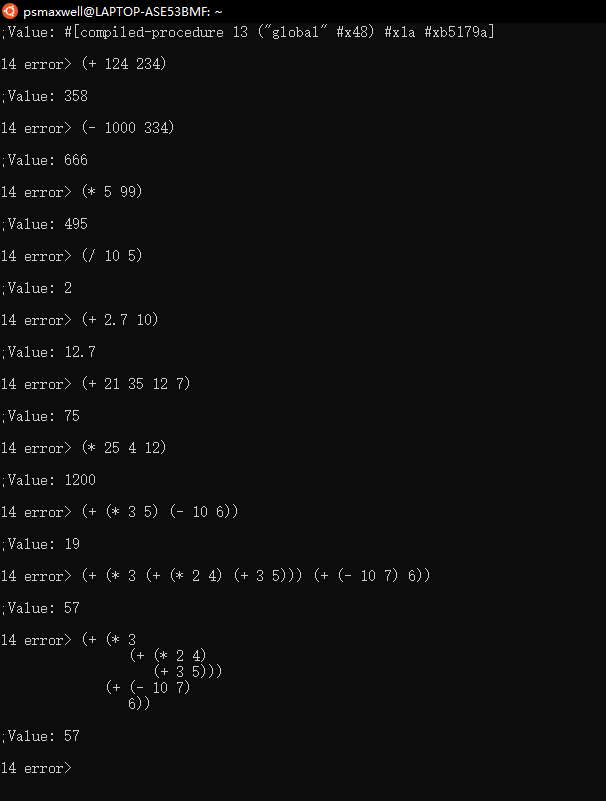
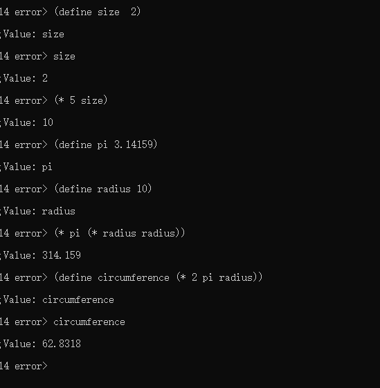
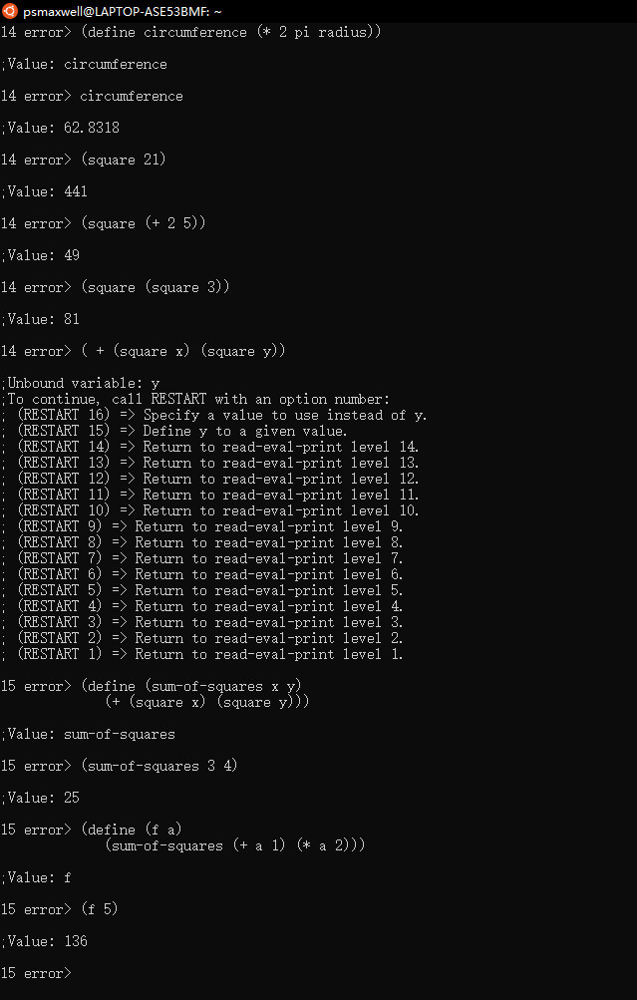
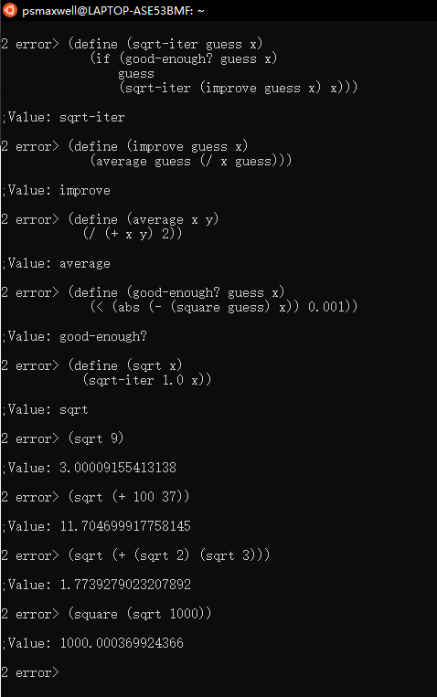

#Structure and Interpretation of Computer Programs

Lisp Language 列表处理程序语言

LISP programming language LISP 程序设计语言

Fortran (firmula translator) 公式翻译程式语言

fortran language 公式翻译语言

semantic structure 语义结构

PASCAL PASCAL语言

Pascal is for building pyramids—imposing, breathtaking, static structures built by armies pushing heavy blocks into place.

Lisp is for building organisms—imposing, breathtaking, dynamic structures built by squads fitting fluctuating myriads of simpler organisms into place.

### Structure and Interpretation of Computer Programs 

 common core curriculum which also includes two subject on circuits and linear systems and a subject on the design of digital systems. 

* A computer language is not just a way of getting a computer to perform operations but rather that it is a novel formal medium for expressiong ideas about methodology.

* The essentail material to be addressed by a subject at this level is not  the syntax of particular programming-language constructs,nor clever algorithms for computing particular functions of computing,but rather the techniques used to control the intellctual complexity of large software systems.

 

# Chapter 1 Building Abstractions with Procedures

*  **1. Combining several simple ideas into one compound one,and thus all complex ideas are made.**
*  **2. The second is bringing two ideas,whether simple or complex,together,and setting them by one another so as to take a view of them at once,without uniting them into one,by which it gets all its ideas of relations.**
*  **3. The third is separating them from all other ideas that accompany them in their real existence: this is called abstraction,and thus all its general ideas are made.**

* **Computational processes are abstract beings that inhabit computers.**

* **processes manipulate other abstract things called data**

* **The evolution of a process is directed by a paern of rules called a program.**

### programing in Lisp
 
###***The dialect of Lisp used in this book is called Scheme.***

##1.1 The Elements of Programming

### Every powerful language has three mechanisms for accomplishing this:
* **primitive expressions**, which represent the simplest entities the language is concerned with,
* **means of combination**, by which compound elements are built from simpler ones, and
* **means of abstraction**, by which compound elements can be named and manipulated as units.

***In programming, we deal with two kinds of elements: procedures and data.***

###1.1.1 Expression

###1.1.2 Naming and the Environment

A critical aspect of a programming language is the means it provides for using names to refer to computational objects. We say that the name identifies a variable whose value is the object.

 

###1.1.3 Evaluating Combinations
To evaluate a combination, do the following:

1. Evaluate the subexpressions of the combination.
2. Apply the procedure that is the value of the lemost subexpression (the operator) to the arguments that are the values of the
other subexpressions (the operands).

###1.1.4 Compound Procedures
We have identified in Lisp some of the elements that must appear in any powerful programming language:

• Numbers and arithmetic operations are primitive data and procedures.

• Nesting of combinations provides a means of combining operations.

• Definitions that associate names with values provide a limited means of abstraction.

 

###1.1.5 The Substitution Model for Procedure Application
For compound procedures, the application process is as follows:

To apply a compound procedure to arguments, evaluate the body of the procedure with each formal parameter replaced by the corresponding argument.

###1.1.6 Conditional Expressions and Predicates
The expressive power of the class of procedures that we can define at this point is very limited, because we have no way to make tests and to perform different operations depending on the result of a test.

###1.1.7 Example: Square Roots by Newton’s Method
Procedures, as introduced above, are much like ordinary mathematical functions. ey specify a value that is determined by one or more parameters. But there is an important difference between mathematical functions and computer procedures. Procedures must be effective.

 

###1.1.8 Procedures as Black-Box Abstractions

sqrt is our first example of a process defined by a set of mutually defined procedures. 

##1.2 Procedures and the Processes They Generate

